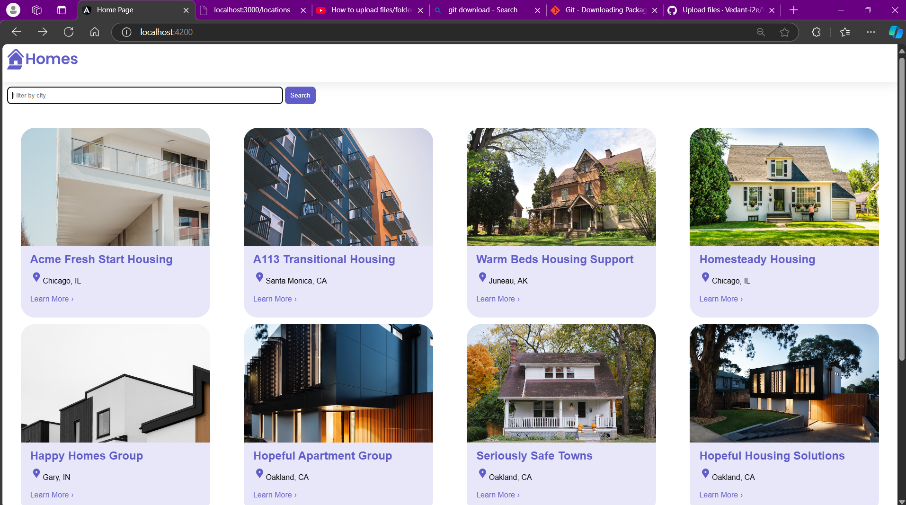

# Angular Homes App
- Install Angular if you don't have it installed

  `npm install -g @angular/cli`

- Clone this branch to your local machine

  `git clone -b homes-app-start git@github.com:angular/codelabs.git homes-app`

- Once the code has been downloaded

  `cd homes-app`

- Install the depencies

  `npm install` 

- Run the application 

  `ng serve`

# Application Screenshots

# Home Sales Web Page

Below is a screenshot of the main interface where users can browse available homes:

# Details Page

Here’s a screenshot of the details page that provides more information about a specific home:

These images illustrate the key components of the home sales web application.

